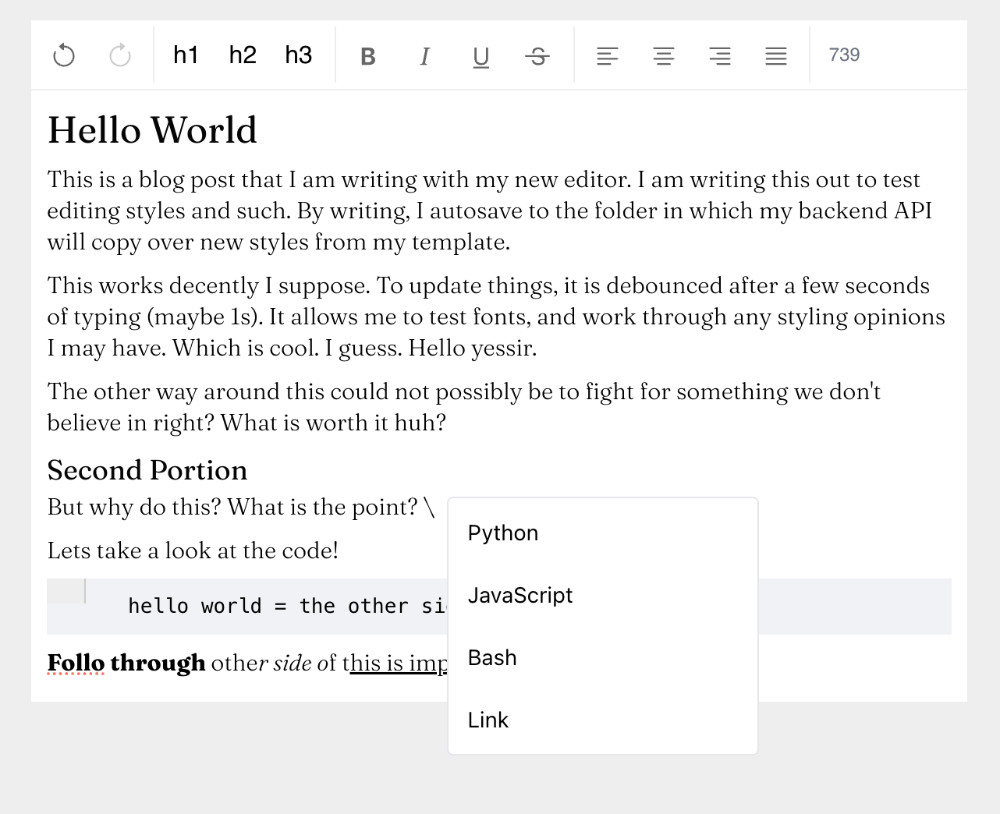

# WYSIWYG Editor



This is my editor to write blog posts and then output them to HTML.

## Starting local editor

Add `.html` files into `/html`.

### Starting frontend
```
npm run edit
```

### Starting backend
```
npm run server
```

⬇️ Automatically saves your work. 

This will allow you to edit files at `http://localhost:4173/posts/edit/<filename>.html` in the browser. 

This correlates to html files located in `/html`. Files are autosaved to this folder.

### Styling posts

CSS is automatically injected when updating posts from `/template/post.css`. These styles correlate between the editor and post, so when you tweak it you will see it directly in both the editor and post (all posts).

### Notes
- Syncing with files will not happen when in dev mode (`npm run dev`)
